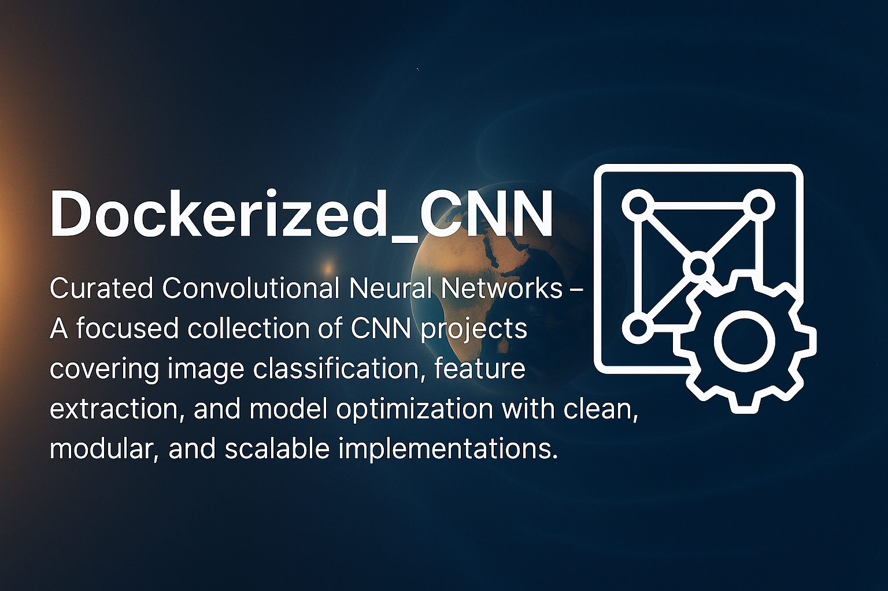

<div style="font-size:2.5em; font-weight:bold; text-align:center; margin-top:20px;">Dockerized Convolutional Neural Network (CNN) Project</div>

<div align="center">
    
</div>

<div align="center">
  <h2>MNIST Digit Recognition Using CNN in Docker</h2>
  <p>An end-to-end solution for digit classification with Convolutional Neural Networks, fully containerized with Docker</p>
</div>

# 1. Table of Contents
<div>
  &nbsp;&nbsp;&nbsp;&nbsp;<a href="#1-project-summary"><i><b>1. Project Summary</b></i></a>
</div>
&nbsp;
<div>
  &nbsp;&nbsp;&nbsp;&nbsp;<a href="#2-learning-goals"><i><b>2. Learning Goals</b></i></a>
</div>
&nbsp;
<div>
  &nbsp;&nbsp;&nbsp;&nbsp;<a href="#3-requirements"><i><b>3. Requirements</b></i></a>
</div>
&nbsp;
<div>
  &nbsp;&nbsp;&nbsp;&nbsp;<a href="#4-directory-overview"><i><b>4. Directory Overview</b></i></a>
</div>
&nbsp;
<details>
  <summary><a href="#5-getting-started"><i><b>5. Getting Started</b></i></a></summary>
  <div>
    &nbsp;&nbsp;&nbsp;&nbsp;&nbsp;&nbsp;&nbsp;&nbsp;&nbsp;&nbsp;<a href="#51-docker-installation">5.1. Docker Installation</a><br>
    &nbsp;&nbsp;&nbsp;&nbsp;&nbsp;&nbsp;&nbsp;&nbsp;&nbsp;&nbsp;<a href="#52-building-and-launching-the-container">5.2. Building and Launching the Container</a><br>
    &nbsp;&nbsp;&nbsp;&nbsp;&nbsp;&nbsp;&nbsp;&nbsp;&nbsp;&nbsp;<a href="#53-checking-container-status">5.3. Checking Container Status</a><br>
    &nbsp;&nbsp;&nbsp;&nbsp;&nbsp;&nbsp;&nbsp;&nbsp;&nbsp;&nbsp;<a href="#54-opening-jupyter-lab">5.4. Opening Jupyter Lab</a><br>
    &nbsp;&nbsp;&nbsp;&nbsp;&nbsp;&nbsp;&nbsp;&nbsp;&nbsp;&nbsp;<a href="#55-connecting-vs-code">5.5. Connecting VS Code to the Container (Optional)</a><br>
    &nbsp;&nbsp;&nbsp;&nbsp;&nbsp;&nbsp;&nbsp;&nbsp;&nbsp;&nbsp;<a href="#56-executing-the-pipeline">5.6. Executing the Pipeline</a><br>
    &nbsp;&nbsp;&nbsp;&nbsp;&nbsp;&nbsp;&nbsp;&nbsp;&nbsp;&nbsp;<a href="#57-halting-and-removing-the-container">5.7. Halting and Removing the Container</a><br>
    &nbsp;&nbsp;&nbsp;&nbsp;&nbsp;&nbsp;&nbsp;&nbsp;&nbsp;&nbsp;<a href="#58-environment-maintenance">5.8. Environment Maintenance</a><br>
  </div>
</details>
&nbsp;
<details>
  <summary><a href="#6-docker-commands"><i><b>6. Docker Commands</b></i></a></summary>
  <div>
    &nbsp;&nbsp;&nbsp;&nbsp;&nbsp;&nbsp;&nbsp;&nbsp;&nbsp;&nbsp;<a href="#61-image-management">6.1. Image Management</a><br>
    &nbsp;&nbsp;&nbsp;&nbsp;&nbsp;&nbsp;&nbsp;&nbsp;&nbsp;&nbsp;<a href="#62-container-management">6.2. Container Management</a><br>
  </div>
</details>
&nbsp;
<details>
  <summary><a href="#7-project-files"><i><b>7. Project Files</b></i></a></summary>
  <div>
    &nbsp;&nbsp;&nbsp;&nbsp;&nbsp;&nbsp;&nbsp;&nbsp;&nbsp;&nbsp;<a href="#71-data-handling">7.1. Data Handling</a><br>
    &nbsp;&nbsp;&nbsp;&nbsp;&nbsp;&nbsp;&nbsp;&nbsp;&nbsp;&nbsp;<a href="#72-cnn-model">7.2. CNN Model</a><br>
    &nbsp;&nbsp;&nbsp;&nbsp;&nbsp;&nbsp;&nbsp;&nbsp;&nbsp;&nbsp;<a href="#73-training-process">7.3. Training Process</a><br>
    &nbsp;&nbsp;&nbsp;&nbsp;&nbsp;&nbsp;&nbsp;&nbsp;&nbsp;&nbsp;<a href="#74-visualization-tools">7.4. Visualization Tools</a><br>
    &nbsp;&nbsp;&nbsp;&nbsp;&nbsp;&nbsp;&nbsp;&nbsp;&nbsp;&nbsp;<a href="#75-results-and-visuals">7.5. Results and Visuals</a><br>
  </div>
</details>
&nbsp;
<div>
  &nbsp;&nbsp;&nbsp;&nbsp;<a href="#8-practice-exercises"><i><b>8. Practice Exercises</b></i></a>
</div>
&nbsp;
<div>
  &nbsp;&nbsp;&nbsp;&nbsp;<a href="#9-frequent-problems"><i><b>9. Frequent Problems</b></i></a>
</div>
&nbsp;
<div>
  &nbsp;&nbsp;&nbsp;&nbsp;<a href="#10-additional-resources"><i><b>10. Additional Resources</b></i></a>
</div>
&nbsp;
<div>
  &nbsp;&nbsp;&nbsp;&nbsp;<a href="#11-license"><i><b>11. License</b></i></a>
</div>
&nbsp;
# 1. Project Summary

This repository provides a Dockerized implementation of a Convolutional Neural Network (CNN) for recognizing handwritten digits using the MNIST dataset. The project ensures a reproducible environment by leveraging Docker for both development and execution.

The MNIST dataset contains 70,000 grayscale images of handwritten numbers (60,000 for training and 10,000 for testing), each sized at 28×28 pixels. The CNN model developed here is capable of classifying these digits with an accuracy exceeding 99%.

# 2. Learning Goals

This project is designed to help you:

- Grasp the structure and benefits of CNNs compared to standard neural networks for image tasks
- Build and train a CNN using TensorFlow/Keras
- Visualize and interpret the internal feature maps of a CNN
- Compare CNN performance with that of a basic ANN
- Learn how to use Docker for consistent machine learning environments

# 3. Requirements

- Docker and Docker Compose must be installed
- Familiarity with Python and neural network basics
- Understanding of image classification principles

# 4. Directory Overview

```
Folder PATH listing
.
+---data                                <-- Contains MNIST dataset files
|       mnist                           <-- Raw and processed MNIST data (created at runtime)
|       mnist_samples                   <-- Example images from MNIST for visualization
|       README.md                       <-- Data directory documentation
|
+---figures                             <-- Plots and visualizations
|       confusion_matrices              <-- Confusion matrix images
|       feature_maps                    <-- CNN feature map images
|       test_samples.png                <-- Feature map activations for test data
|       confusion_matrix.png            <-- Model performance plot
|       feature_maps.png                <-- Overview of feature maps
|       mnist_samples.png               <-- Grid of MNIST digit samples
|       prediction_samples.png          <-- Model prediction examples
|       README.md                       <-- Visualizations documentation
|       simple_cnn_confusion_matrix.png <-- Confusion matrix for simple CNN
|       simple_cnn_misclassified.png    <-- Misclassified digit examples
|       simple_cnn_training_history.png <-- Training metrics for simple CNN
|       training_history.png            <-- Training/validation metrics
|
+---models                              <-- Model code and saved weights
|       architectures                   <-- CNN architecture code
|       configs                         <-- Model configuration files
|       evaluation                      <-- Model evaluation scripts
|       training                        <-- Model training scripts
|       __init__.py                     <-- Package initializer
|       mnist_cnn_best.h5               <-- Best model (by validation accuracy)
|       mnist_cnn_final.h5              <-- Final trained model
|       model_factory.py                <-- Model creation factory
|       model_registry.py               <-- Model registry
|       README.md                       <-- Models documentation
|       simple_cnn_final.h5             <-- Trained simple CNN model
|
+---notebooks                           <-- Jupyter notebooks for exploration
|       01_data_exploration.ipynb       <-- Data exploration/visualization
|       02_model_training.ipynb         <-- Model training/evaluation
|       figures/                        <-- Notebook-generated figures
|       models/                         <-- Notebook-saved models
|       README.md                       <-- Notebooks documentation
|
+---scripts                             <-- Standalone Python scripts
|       data_prep.py                    <-- Download/preprocess MNIST
|       extract_sample_images.py        <-- Extract images for visualization
|       README.md                       <-- Scripts documentation
|       train_cnn.py                    <-- Train the CNN
|       visualize_features.py           <-- Create feature map visualizations
|
+---utils                               <-- Helper functions
|       README.md                       <-- Utilities documentation
|       toc_generator.py                <-- Markdown TOC generator
|
|   .dockerignore                       <-- Docker ignore rules
|   .gitignore                          <-- Git ignore rules
|   docker-compose.yml                  <-- Docker Compose service config
|   Dockerfile                          <-- Docker build instructions
|   LICENSE                             <-- License details
|   README.md                           <-- Project overview and guide
|   requirements.txt                    <-- Python dependencies
|   start.sh                            <-- Docker container startup script
```

# 5. Getting Started

## 5.1 Docker Installation

Clone the repository and move into the project folder:

```bash
git clone <repository-url>
cd CNN_MNIST_Dockerized
```

## 5.2 Building and Launching the Container

You can start the Docker container in two ways:

### Option 1: Using start.sh (Preferred)

Make the script executable and run it to build and start the container:

```bash
chmod +x start.sh
./start.sh
```

### Option 2: Using Docker Compose Directly

Alternatively, build and run the container manually:

```bash
docker-compose up --build -d
```

**Notes:**
* `--build`: Forces Docker to rebuild the image, applying any updates
* `-d`: Runs the container in the background

## 5.3 Checking Container Status

To confirm the container is running:

```bash
docker-compose ps
```

Ensure the status is "Up" and port 8889 is mapped to 8888 inside the container.

## 5.4 Opening Jupyter Lab

Open your browser and go to:

```
http://localhost:8889
```

Port 8889 on your machine is mapped to 8888 in the container. Always use 8889 in your browser. No password or token is needed, as authentication is disabled for convenience.

## 5.5 Connecting VS Code to the Container (Optional)

For enhanced development, you can attach VS Code to the running container:

1. Press `Ctrl+Shift+P` to open the command palette
2. Search for and select `Dev Containers: Attach to Running Container…`
3. Pick the container named `cnn_mnist_dockerized-cnn_mnist-1`
4. A new VS Code window will open
5. Click `Open Folder`, navigate to `/app`, and confirm
6. Install recommended extensions: `Docker`, `Dev Containers`, `Python`, and `Jupyter`
7. You can now edit and run code directly in the container

## 5.6 Executing the Pipeline

To run the full MNIST CNN workflow:

```bash
# Inside the container
python scripts/data_prep.py
python scripts/extract_sample_images.py
python scripts/train_cnn.py
python scripts/visualize_features.py
```

Alternatively, you can use the Jupyter Lab interface to run the notebooks interactively.

## 5.7 Halting and Removing the Container

When finished, stop and remove the container:

```bash
docker-compose down
```

This will stop and delete the container, but your data remains safe due to volume mounting.

## 5.8 Environment Maintenance

- **Rebuild after changes:**
  ```bash
  docker-compose up --build -d
  ```
- **Update requirements.txt** after adding packages:
  ```bash
  # Inside the container
  pip freeze > requirements.txt
  ```
- **Pull the latest base image:**
  ```bash
  docker-compose build --pull
  ```

# 6. Docker Commands

## 6.1 Image Management

```bash
# List all images
docker images

# Remove specific images
docker rmi <image1> <image2>

# Remove all unused images
docker image prune -a
```

## 6.2 Container Management

```bash
# List running containers
docker ps

# List all containers (including stopped)
docker ps -a

# List only container IDs
docker ps -aq

# Remove specific containers
docker rm <container1> <container2>

# Remove all containers
docker rm $(docker ps -aq)

# Start/stop containers
docker start <container_id>
docker stop <container_id>

# View logs
docker logs <container_id>

# Run a command in a running container
docker exec -it <container_id> bash
```

**Tip:** You can use just the first few characters of a container ID.

# 7. Project Files

## 7.1 Data Handling

The MNIST dataset is downloaded and processed automatically by the scripts. Data is normalized and split into training, validation, and test sets.

## 7.2 CNN Model

The CNN includes:
- Several convolutional layers with suitable filter sizes
- Max pooling for downsampling
- Dropout for regularization
- Dense layers for classification
- Softmax output for 10 digit classes (0-9)

## 7.3 Training Process

Training uses:
- Data augmentation (rotation, zoom, shift)
- Categorical cross-entropy loss
- Adam optimizer
- Early stopping and model checkpointing
- Validation accuracy and loss tracking

## 7.4 Visualization Tools

Visualizations include:
- Example MNIST digits
- Training/validation metrics
- Confusion matrix
- CNN feature maps
- Correct and incorrect predictions

## 7.5 Results and Visuals

Below are some outputs and visualizations from the model:

### MNIST Digit Samples


### Training Progress
Shows accuracy and loss for training and validation:


### Confusion Matrix
Displays classification results for all digits:


### Misclassified Digits
Examples of incorrect predictions:


### CNN Feature Maps
Feature map visualizations from convolutional layers:


# 8. Practice Exercises

1. Change the CNN structure and see how it impacts results
2. Compare CNN with a simple MLP
3. Try different data augmentation methods
4. Visualize feature maps from various layers to understand CNN learning

# 9. Frequent Problems

- **Docker Memory Limits**: If Docker crashes, increase its memory allocation in settings
- **Slow Training**: For faster runs, enable GPU access for Docker if available
- **Jupyter Lab Not Loading**: Make sure port 8889 is free
- **Permission Errors**: If you see "Permission denied" when creating folders, check your user permissions or run Docker with `--user $(id -u):$(id -g)` to match host and container permissions.

# 10. Additional Resources

- [CS231n: Convolutional Neural Networks for Visual Recognition](http://cs231n.stanford.edu/)
- [TensorFlow Documentation](https://www.tensorflow.org/tutorials)
- [Deep Learning Book by Ian Goodfellow](https://www.deeplearningbook.org/)

# 11. License

This project is distributed under the MIT License. See the LICENSE file for more details.