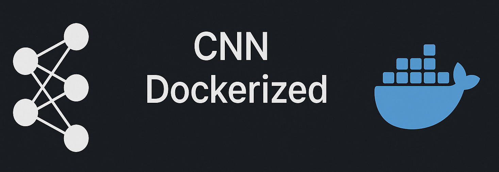
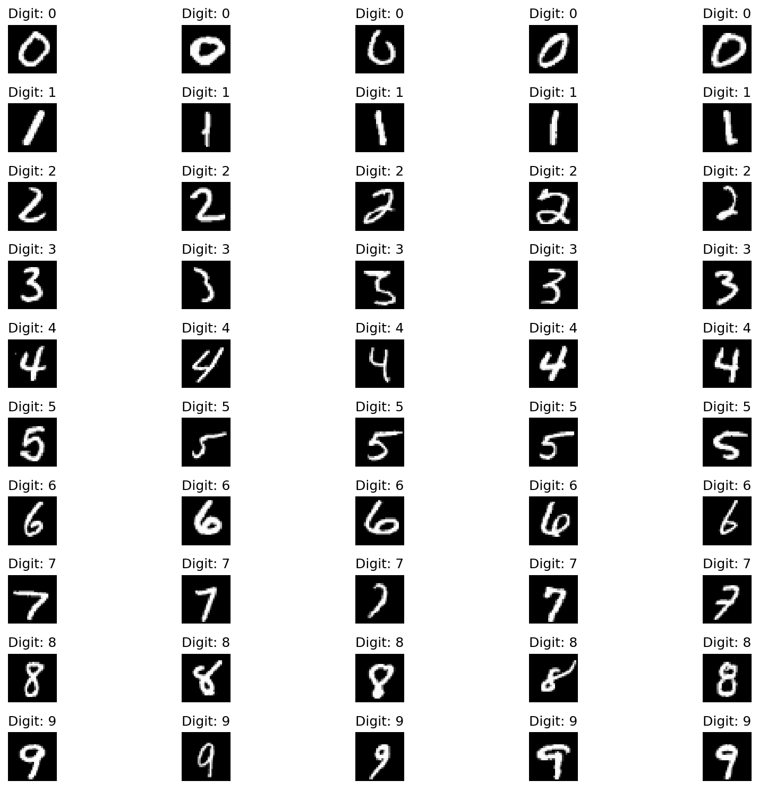
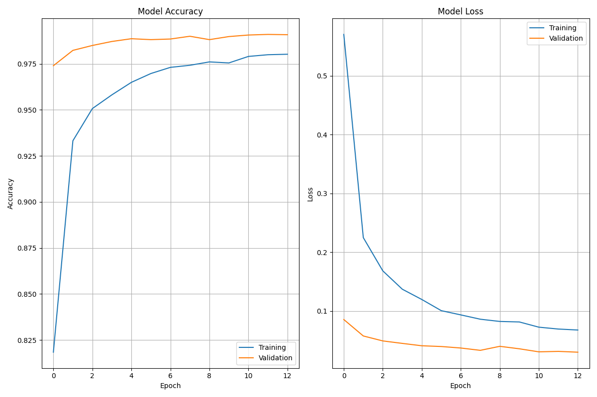
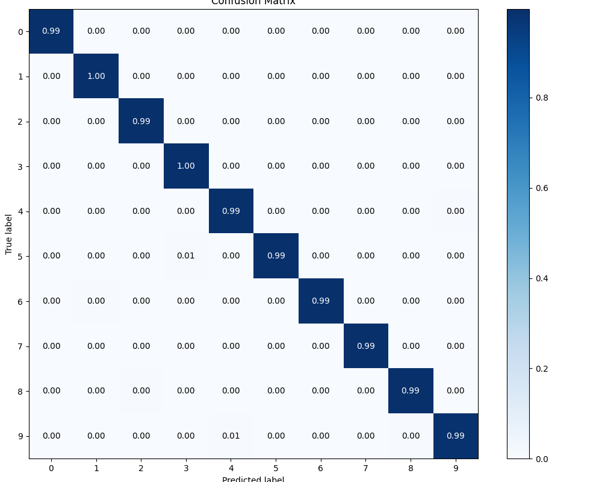
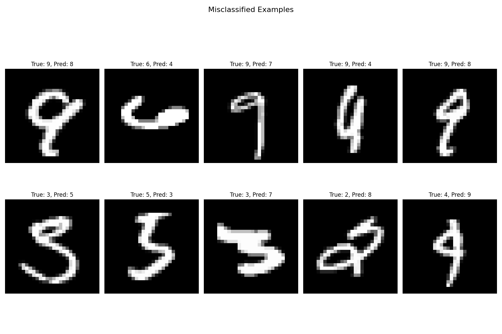
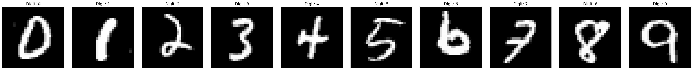

## 🧰 How to Use This Template    

Click the green **"Use this template"** button at the top of the page, then choose **"Create a new repository"**.   

This will create your own copy of this project, which you can modify freely — no need to fork!   

---    

<div align="center">
    
</div>

<h1 align="center">Convolutional Neural Network (CNN): A Dockerized Project</h1>

<div align="center">
  <h2>CNN-Based MNIST Digit Recognition</h2>
  <p>A comprehensive project for digit recognition using Convolutional Neural Networks in Docker</p>
</div>

## Table of Contents 
<div>
  &nbsp;&nbsp;&nbsp;&nbsp;<a href="#1-project-overview"><i><b>1. Project Overview</b></i></a>
</div>
&nbsp;

<div>
  &nbsp;&nbsp;&nbsp;&nbsp;<a href="#2-educational-objectives"><i><b>2. Educational Objectives</b></i></a>
</div>
&nbsp;

<div>
  &nbsp;&nbsp;&nbsp;&nbsp;<a href="#3-prerequisites"><i><b>3. Prerequisites</b></i></a>
</div>
&nbsp;

<div>
  &nbsp;&nbsp;&nbsp;&nbsp;<a href="#4-project-structure"><i><b>4. Project Structure</b></i></a>
</div>
&nbsp;

<details>
  <summary><a href="#5-getting-started"><i><b>5. Getting Started</b></i></a></summary>
  <div>
    &nbsp;&nbsp;&nbsp;&nbsp;&nbsp;&nbsp;&nbsp;&nbsp;&nbsp;&nbsp;<a href="#51-docker-setup">5.1. Docker Setup</a><br>
    &nbsp;&nbsp;&nbsp;&nbsp;&nbsp;&nbsp;&nbsp;&nbsp;&nbsp;&nbsp;<a href="#52-building-and-running-the-docker-container">5.2. Building and Running the Docker Container</a><br>
    &nbsp;&nbsp;&nbsp;&nbsp;&nbsp;&nbsp;&nbsp;&nbsp;&nbsp;&nbsp;<a href="#53-verifying-the-container-status">5.3. Verifying the Container Status</a><br>
    &nbsp;&nbsp;&nbsp;&nbsp;&nbsp;&nbsp;&nbsp;&nbsp;&nbsp;&nbsp;<a href="#54-accessing-jupyter-lab">5.4. Accessing Jupyter Lab</a><br>
    &nbsp;&nbsp;&nbsp;&nbsp;&nbsp;&nbsp;&nbsp;&nbsp;&nbsp;&nbsp;<a href="#55-attaching-vs-code-to-the-container">5.5. Attaching VS Code to the Container (Optional)</a><br>
    &nbsp;&nbsp;&nbsp;&nbsp;&nbsp;&nbsp;&nbsp;&nbsp;&nbsp;&nbsp;<a href="#56-running-the-pipeline">5.6. Running the Pipeline</a><br>
    &nbsp;&nbsp;&nbsp;&nbsp;&nbsp;&nbsp;&nbsp;&nbsp;&nbsp;&nbsp;<a href="#57-stopping-and-removing-the-container">5.7. Stopping and Removing the Container</a><br>
    &nbsp;&nbsp;&nbsp;&nbsp;&nbsp;&nbsp;&nbsp;&nbsp;&nbsp;&nbsp;<a href="#58-maintaining-your-environment">5.8. Maintaining Your Environment</a><br>
  </div>
</details>
&nbsp;

<details>
  <summary><a href="#6-essential-docker-commands"><i><b>6. Essential Docker Commands</b></i></a></summary>
  <div>
    &nbsp;&nbsp;&nbsp;&nbsp;&nbsp;&nbsp;&nbsp;&nbsp;&nbsp;&nbsp;<a href="#61-managing-images">6.1. Managing Images</a><br>
    &nbsp;&nbsp;&nbsp;&nbsp;&nbsp;&nbsp;&nbsp;&nbsp;&nbsp;&nbsp;<a href="#62-managing-containers">6.2. Managing Containers</a><br>
  </div>
</details>
&nbsp;

<details>
  <summary><a href="#7-project-components"><i><b>7. Project Components</b></i></a></summary>
  <div>
    &nbsp;&nbsp;&nbsp;&nbsp;&nbsp;&nbsp;&nbsp;&nbsp;&nbsp;&nbsp;<a href="#71-data-preparation">7.1. Data Preparation</a><br>
    &nbsp;&nbsp;&nbsp;&nbsp;&nbsp;&nbsp;&nbsp;&nbsp;&nbsp;&nbsp;<a href="#72-cnn-architecture">7.2. CNN Architecture</a><br>
    &nbsp;&nbsp;&nbsp;&nbsp;&nbsp;&nbsp;&nbsp;&nbsp;&nbsp;&nbsp;<a href="#73-model-training">7.3. Model Training</a><br>
    &nbsp;&nbsp;&nbsp;&nbsp;&nbsp;&nbsp;&nbsp;&nbsp;&nbsp;&nbsp;<a href="#74-visualizations">7.4. Visualizations</a><br>
    &nbsp;&nbsp;&nbsp;&nbsp;&nbsp;&nbsp;&nbsp;&nbsp;&nbsp;&nbsp;<a href="#75-results-and-visualizations">7.5. Results and Visualizations</a><br>
  </div>
</details>
&nbsp;

<div>
  &nbsp;&nbsp;&nbsp;&nbsp;<a href="#8-learning-exercises"><i><b>8. Learning Exercises</b></i></a>
</div>
&nbsp;

<div>
  &nbsp;&nbsp;&nbsp;&nbsp;<a href="#9-common-issues"><i><b>9. Common Issues</b></i></a>
</div>
&nbsp;

<div>
  &nbsp;&nbsp;&nbsp;&nbsp;<a href="#10-resources-for-further-learning"><i><b>10. Resources for Further Learning</b></i></a>
</div>
&nbsp;

<div>
  &nbsp;&nbsp;&nbsp;&nbsp;<a href="#11-license"><i><b>11. License</b></i></a>
</div>
&nbsp;

## 1. Project Overview

This project demonstrates implementing a Convolutional Neural Network (CNN) for handwritten digit recognition using the MNIST dataset. The entire project is containerized using Docker to ensure a consistent environment for development and execution.

The MNIST dataset consists of 70,000 grayscale images of handwritten digits (60,000 for training and 10,000 for testing), each 28×28 pixels in size. Using a CNN, we'll build a model that can accurately classify these digits with over 99% accuracy.

## 2. Educational Objectives

This project serves as a learning tool for:

- Understanding CNN architectures and their advantages over standard ANNs for image processing
- Implementing and training a CNN using TensorFlow/Keras
- Visualizing and interpreting CNN feature maps
- Comparing performance between CNN and traditional ANN approaches
- Learning Docker containerization for reproducible machine learning environments

## 3. Prerequisites

- Docker and Docker Compose installed on your system
- Basic knowledge of Python and neural networks
- Understanding of image classification concepts

## 4. Project Structure

```
Folder PATH listing
.
+---data                                <-- Data directory for MNIST dataset
|       mnist                           <-- Raw and processed MNIST data (generated at runtime)
|       mnist_samples                   <-- Sample images extracted from MNIST for visualization
|       README.md                       <-- Documentation for the dataset
|
+---figures                             <-- Visualizations and plots
|       confusion_matrices              <-- Directory for confusion matrix visualizations
|       feature_maps                    <-- CNN feature map visualizations
|       test_samples.png                <-- Feature map activations for test samples
|       confusion_matrix.png            <-- Model performance visualization
|       feature_maps.png                <-- Feature map visualization overview
|       mnist_samples.png               <-- Grid of sample MNIST digits
|       prediction_samples.png          <-- Examples of model predictions
|       README.md                       <-- Documentation for visualizations
|       simple_cnn_confusion_matrix.png <-- Simple CNN confusion matrix
|       simple_cnn_misclassified.png    <-- Misclassified examples
|       simple_cnn_training_history.png <-- Training metrics for simple CNN
|       training_history.png            <-- Training/validation metrics over time
|
+---models                              <-- Model implementations and saved files
|       architectures                   <-- CNN architecture implementations
|       configs                         <-- Model configuration files
|       evaluation                      <-- Model evaluation utilities
|       training                        <-- Model training utilities
|       __init__.py                     <-- Package initialization
|       mnist_cnn_best.h5               <-- Best model based on validation accuracy
|       mnist_cnn_final.h5              <-- Final trained model
|       model_factory.py                <-- Factory for creating model instances
|       model_registry.py               <-- Registry of available models
|       README.md                       <-- Documentation for models
|       simple_cnn_final.h5             <-- Trained simple CNN model
|
+---notebooks                           <-- Jupyter notebooks for interactive learning
|       01_data_exploration.ipynb       <-- Data exploration and visualization notebook
|       02_model_training.ipynb         <-- Model training and evaluation notebook
|       figures/                        <-- Generated visualizations
|       models/                         <-- Saved models from notebooks
|       README.md                       <-- Documentation for notebooks
|
+---scripts                             <-- Python scripts
|       data_prep.py                    <-- Download and preprocess MNIST data
|       extract_sample_images.py        <-- Extract sample images for visualization
|       README.md                       <-- Documentation for scripts
|       train_cnn.py                    <-- Train the CNN model
|       visualize_features.py           <-- Generate feature map visualizations
|
+---utils                               <-- Utility functions and helpers
|       README.md                       <-- Documentation for utilities
|       toc_generator.py                <-- Table of contents generator for markdown files
|
|   .dockerignore                       <-- Docker ignore file
|   .gitignore                          <-- Git ignore file
|   docker-compose.yml                  <-- Docker Compose configuration for service definition
|   Dockerfile                          <-- Docker configuration for environment setup
|   LICENSE                             <-- Project license information
|   README.md                           <-- Project overview and instructions
|   requirements.txt                    <-- Python dependencies for the project
|   start.sh                            <-- Startup script for Docker container
```

## 5. Getting Started

### 5.1 Docker Setup

Clone this repository and navigate to the project directory:

```bash
git clone <repository-url>
cd CNN_MNIST_Dockerized
```

### 5.2 Building and Running the Docker Container

You have two options to build and run the Docker container:

#### Option 1: Using start.sh (Recommended)

This method makes the start.sh executable and runs it to build and start the container:

```bash
# Make start.sh executable (if it's not already)
chmod +x start.sh

# Build and run the container
./start.sh
```

#### Option 2: Using Docker Compose Directly

In this method, you manually build and run the container using Docker Compose:

```bash
docker-compose up --build -d
```

**Note:**
* `--build`: Ensures that Docker rebuilds the image, applying any changes to the Dockerfile or dependencies
* `-d`: Runs the container in detached mode, allowing you to continue using the terminal

### 5.3 Verifying the Container Status

To check if the container is running properly:

```bash
docker-compose ps
```

Make sure the container status is "Up" and port 8889 is mapped to port 8888 in the container.

### 5.4 Accessing Jupyter Lab

Access Jupyter Lab in your browser at:

```
http://localhost:8889
```

Note: We map port 8889 on your host to port 8888 in the container. Always use port 8889 in your browser.

There's no token or password required as the configuration disables authentication for ease of use.

### 5.5 Attaching VS Code to the Container (Optional)

For a better development experience, you can attach VS Code to the running container:

1. Press `Ctrl+Shift+P` to open the command palette
2. Type and select `Dev Containers: Attach to Running Container…`
3. Choose the container named `cnn_mnist_dockerized-cnn_mnist-1`
4. A second VS Code window will open
5. In the second window, click `Open Folder`, navigate to `/app`, and click `OK`
6. Install useful extensions: `Docker`, `Dev Containers`, `Python`, and `Jupyter`
7. Now you can edit files and run commands directly in the container

### 5.6 Running the Pipeline

To run the entire CNN MNIST pipeline from data preparation to visualization:

```bash
# Inside the Docker container
python scripts/data_prep.py
python scripts/extract_sample_images.py
python scripts/train_cnn.py
python scripts/visualize_features.py
```

Alternatively, you can run these scripts through the Jupyter Lab interface by opening and executing the notebooks.

### 5.7 Stopping and Removing the Container

When you're done working with the container:

```bash
docker-compose down
```

This will stop and remove the container, but your data will be preserved since we're using a volume mount.

### 5.8 Maintaining Your Environment

- **Rebuilding with changes**:
  ```bash
  docker-compose up --build -d
  ```

- **Updating requirements.txt** after installing new packages:
  ```bash
  # Inside the container
  pip freeze > requirements.txt
  ```

- **Pulling the latest base image**:
  ```bash
  docker-compose build --pull
  ```

## 6. Essential Docker Commands

### 6.1 Managing Images

```bash
# List all images
docker images

# Remove specific images
docker rmi <image1> <image2>

# Remove all unused images
docker image prune -a
```

### 6.2 Managing Containers

```bash
# List running containers
docker ps

# List all containers (including stopped)
docker ps -a

# List just container IDs
docker ps -aq

# Remove specific containers
docker rm <container1> <container2>

# Remove all containers
docker rm $(docker ps -aq)

# Start/stop containers
docker start <container_id>
docker stop <container_id>

# View container logs
docker logs <container_id>

# Execute a command in a running container
docker exec -it <container_id> bash
```

**Note**: You can use just the first few characters of a container ID for identification.

## 7. Project Components

### 7.1 Data Preparation

The MNIST dataset is automatically downloaded and preprocessed when running the scripts. The data is normalized and split into training, validation, and test sets.

### 7.2 CNN Architecture

Our CNN model consists of:
- Multiple convolutional layers with appropriate filter sizes
- Max pooling layers for downsampling
- Dropout for regularization
- Dense layers for classification
- Softmax output for 10 digit classes (0-9)

### 7.3 Model Training

The model is trained with:
- Data augmentation (rotation, zoom, shift)
- Categorical cross-entropy loss
- Adam optimizer
- Early stopping and model checkpointing
- Validation accuracy and loss monitoring

### 7.4 Visualizations

The project includes visualizations for:
- Sample digits from the MNIST dataset
- Training and validation metrics
- Confusion matrix of model predictions
- CNN feature maps
- Examples of correct and incorrect predictions

### 7.5 Results and Visualizations

Here are some of the results and visualizations from running the model:

### MNIST Sample Digits


### Training History
This plot shows the training and validation accuracy and loss over epochs:


### Confusion Matrix
The confusion matrix shows the model's classification performance across all digit classes:


### Misclassified Examples
Some examples of digits that were misclassified by the model:


### CNN Feature Maps
Visualization of the feature maps from convolutional layers:


## 8. Learning Exercises

1. Modify the CNN architecture and observe how it affects performance
2. Compare the CNN results with a simple multi-layer perceptron (MLP)
3. Experiment with different data augmentation techniques
4. Visualize feature maps from different layers to understand what the CNN learns

## 9. Common Issues

- **Docker Memory Issues**: If Docker crashes, try increasing the memory allocation in Docker settings
- **Training Performance**: For faster training, ensure Docker has access to GPU resources if available
- **Jupyter Lab Connection**: If you can't connect to Jupyter Lab, check that port 8889 is not in use by another application
- **Permission Issues**: If you encounter "Permission denied" errors when creating directories, make sure your user has write permissions to the project directory. Alternatively, run Docker with the `--user $(id -u):$(id -g)` flag to match container permissions with host permissions.

## 10. Resources for Further Learning

- [CS231n: Convolutional Neural Networks for Visual Recognition](http://cs231n.stanford.edu/)
- [TensorFlow Documentation](https://www.tensorflow.org/tutorials)
- [Deep Learning Book by Ian Goodfellow](https://www.deeplearningbook.org/)

## 11. License

This project is licensed under the MIT License - see the LICENSE file for details.